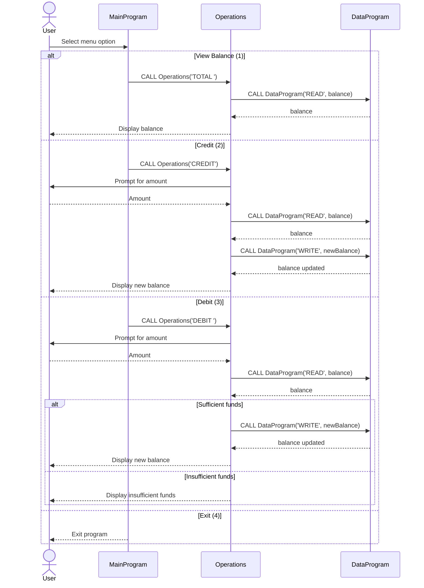

# COBOL Student Account System Documentation

## Overview
This documentation describes the purpose and behavior of the COBOL programs in this repository. The system provides a simple student account management flow with balance inquiry, credit, and debit operations.

## Files and Responsibilities

### data.cob (Program-ID: DataProgram)
Purpose:
- Holds the persistent account balance in working storage.
- Provides read and write access to the balance through the linkage interface.

Key functions:
- Read operation: returns the stored balance to the caller.
- Write operation: updates the stored balance with the value provided by the caller.

Business rules:
- The balance is initialized to 1000.00.
- Only the exact operation codes 'READ' and 'WRITE' are recognized.

### operations.cob (Program-ID: Operations)
Purpose:
- Implements the account operations requested by the main menu.
- Orchestrates read/modify/write flow by calling DataProgram.

Key functions:
- TOTAL: reads and displays the current balance.
- CREDIT: prompts for an amount, adds it to the balance, and writes the new balance.
- DEBIT: prompts for an amount, checks funds, subtracts when possible, and writes the new balance.

Business rules:
- The operation code must be one of: 'TOTAL ', 'CREDIT', or 'DEBIT ' (note the trailing space for 6-char fields).
- Debit is allowed only when the balance is greater than or equal to the requested amount.
- Balance is displayed after successful credit or debit.

### main.cob (Program-ID: MainProgram)
Purpose:
- Presents the user menu and routes user choices to the Operations program.

Key functions:
- Menu loop: continues until the user selects Exit.
- Calls Operations with the mapped operation code based on user input.

Business rules:
- Valid choices are 1-4. Any other value shows an error message.
- Exit sets the continue flag to 'NO' and terminates the program.

## Student Account Business Rules Summary
- Starting balance is 1000.00.
- Credits increase the balance by the entered amount.
- Debits reduce the balance only if sufficient funds exist.
- Operation codes are fixed-width 6-character fields.

## Sequence Diagram

